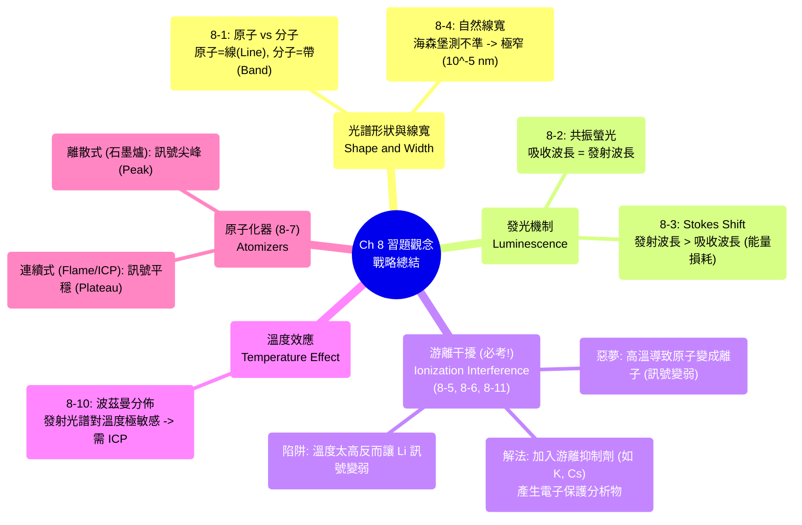

```mermaid

mindmap
  root(("Ch 8 習題觀念<br/>戰略總結"))
    Shape("光譜形狀與線寬<br/>Shape and Width")
      Q8_1("8-1: 原子 vs 分子<br/>原子=線(Line), 分子=帶(Band)")
      Q8_4("8-4: 自然線寬<br/>海森堡測不準 -> 極窄 (10^-5 nm)")
    Light("發光機制<br/>Luminescence")
      Q8_2("8-2: 共振螢光<br/>吸收波長 = 發射波長")
      Q8_3("8-3: Stokes Shift<br/>發射波長 > 吸收波長 (能量損耗)")
    Ion("游離干擾 (必考!)<br/>Ionization Interference<br/>(8-5, 8-6, 8-11)")
      Problem("惡夢: 高溫導致原子變成離子 (訊號變弱)")
      Solution("解法: 加入游離抑制劑 (如 K, Cs)<br/>產生電子保護分析物")
      TempTrap("陷阱: 溫度太高反而讓 Li 訊號變弱")
    Temp("溫度效應<br/>Temperature Effect")
      Q8_10("8-10: 波茲曼分佈<br/>發射光譜對溫度極敏感 -> 需 ICP")
    Atomizer("原子化器 (8-7)<br/>Atomizers")
      Cont("連續式 (Flame/ICP): 訊號平穩 (Plateau)")
      Disc("離散式 (石墨爐): 訊號尖峰 (Peak)")

```
